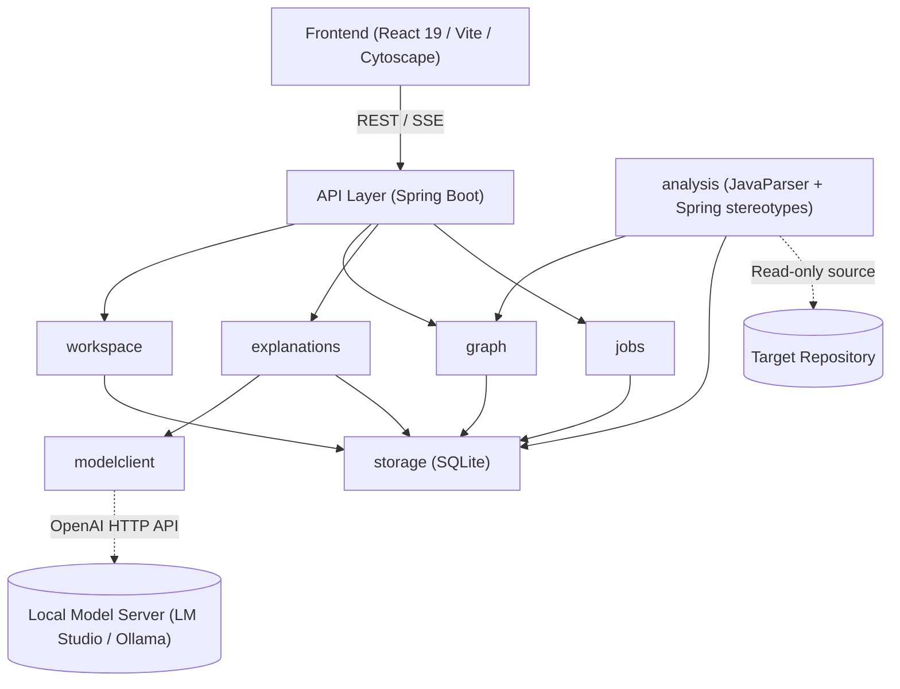
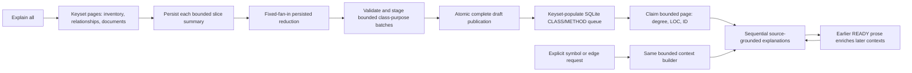

# Code Atlas — Architecture

## 1. System Overview

Code Atlas is structured as a local, lightweight modular monolith designed for privacy-preserving code comprehension:

- **Backend (Spring Boot 3.4.3 / Java 21)**: Runs on loopback (`http://127.0.0.1:8085`), coordinating AST parsing, static symbol resolution, graph querying, and local LLM orchestration.
- **Frontend (React 19 / TypeScript / Vite)**: Single-page application providing an interactive canvas powered by Cytoscape.js for dependency graphs, coupled with source inspection.
- **Storage (SQLite 3 via JDBC)**: Embedded zero-config database configured with Write-Ahead Logging (WAL) and strict foreign key constraints, managed via Flyway migrations.



---

## 2. Module Boundaries

The backend enforces strict modular separation across domain boundaries:

| Module | Responsibility |
|---|---|
| `workspace` | Project root registration, path traversal validation, file filtering (includes/excludes), trust boundaries. |
| `analysis` | JavaParser integration, symbol extraction, type solving, relationship extraction, exact evidence coordinate calculation. |
| `analysis` (Spring heuristics) | Heuristic recognition of Spring stereotypes (`@Service`, `@Repository`, `@RestController`), constructor injection, `@Qualifier`, `@Bean`, and HTTP routes. Implemented by `analysis/SpringAnnotationAnalyzer.java`; this is not a separate top-level package. |
| `graph` | Graph querying, neighborhood traversal, package/class aggregation, search, cycle detection, and filtering. |
| `explanations` | Context construction, prompt generation, JSON response schema validation, claim basis attribution, and explanation caching. |
| `modelclient` | OpenAI-compatible HTTP client adapter, connectivity verification, latency tracking, timeouts, and error handling. |
| `jobs` | Background task orchestration, progress tracking, status reporting, cancellation, and restart recovery. |
| `storage` | SQLite connection management, Flyway migrations, database constraints, and repository data access. |
| `api` | REST endpoints, SSE stream handlers, DTO validation, and structured error responses. |

---

## 3. Trust Model: Parser Facts vs. AI Explanations

Code Atlas strictly decouples deterministic code facts from probabilistic language model explanations:

```
+-------------------------------------------------------------------------+
|                              CODE FACTS                                 |
| Source: JavaParser AST & Symbol Solver (Deterministic)                 |
| Authority: Defines graph topology, symbols, call sites, and evidence.   |
| Statuses: resolved | candidate | unresolved                            |
+-------------------------------------------------------------------------+
                                    |
                                    v
+-------------------------------------------------------------------------+
|                           AI EXPLANATIONS                               |
| Source: Local LLM (Probabilistic)                                      |
| Authority: Generates narrative summaries and inferred purposes.         |
| Constraint: Cannot create, modify, or delete graph nodes or edges.     |
| Claim Basis: source_fact | inferred_purpose | unknown                   |
+-------------------------------------------------------------------------+
```

1. **Deterministic Code Facts**: Parser facts own graph topology. Nodes (classes, methods) and edges (calls, injection, inheritance) are grounded directly in source text with byte/line/column ranges.
2. **Probabilistic Explanations**: Model output provides explanations only. Every explanation references specific evidence IDs, records prompt/model provenance, and separates verifiable source facts from inferred developer intent.
3. **Graceful Degradation**: If the local model is unconfigured or offline, graph visualization, symbol lookup, and source navigation remain fully functional.

---

## 4. Data Flow

```
[Import Source] ──> [Parse AST] ──> [Resolve Symbols] ──> [Publish Snapshot] ──> [Query Graph] ──> [Generate Explanation]
```

1. **Import**: User registers a local repository directory. The workspace boundary checks ensure paths are safe and canonicalized.
2. **Parse**: Source files are discovered and parsed into ASTs using JavaParser. Type declarations, methods, fields, and constructors are extracted.
3. **Resolve**: Relationships (call sites, type usages, inheritance, Spring bean injections) are resolved against the symbol table, assigning an explicit status (`resolved`, `candidate`, `unresolved`).
4. **Snapshot**: Extracted symbols, relationships, and evidence ranges are written to SQLite within an isolated staging snapshot. Upon complete validation, the snapshot is atomically marked published.
5. **Graph**: The frontend queries the graph service to obtain filtered, focused, or aggregated graph views rendered via Cytoscape.js.
6. **Explain**: When an element or relationship is inspected, relevant code evidence and graph context are assembled into a constrained prompt sent to the local model. Responses are validated against a strict JSON schema before display.

---

## 5. Frontend Feature Folders

The frontend is structured by functional domain under `frontend/src/features/`:

- **`import/`**: Repository registration, source path selection, scan progress, and diagnostics.
- **`explorer/`**: Interactive Cytoscape graph canvas, package/class navigation pane, search, minimap, and zoom controls.
- **`inspector/`**: Contextual sidebar displaying selected symbol/relationship details, parser evidence, and AI explanations.
- **`source/`**: Embedded source code viewer with line/column highlighting mapped to evidence coordinates.
- **`settings/`**: Configuration interface for local model endpoints (LM Studio, Ollama), token budgets, and indexing rules.

### Explorer scope boundary

Backend PACKAGE symbols remain flat parser facts. The explorer constructs a display-only
trie from their dotted qualified names so missing namespace prefixes can be shown without
creating canonical symbols or edges. Synthetic namespace checkboxes aggregate and batch-edit
their real descendant package IDs through the same immutable `ScopeSelection` helpers used
by leaf package/class controls. Shared single-child namespace paths start expanded, branch
points start collapsed, and selection/search expands the owning package path.

Within an active snapshot, navigation and inspection do not mutate scope. Scope changes only
through explicitly labelled tree/reset controls or Cytoscape's “Remove from scope” command.
That command resolves methods/constructors to their owning class and delegates to the existing
package/class toggles. Loading another snapshot initializes a new whole-system selection because
the prior snapshot's symbol IDs are no longer a valid boundary.

### Exploration tabs and undo history

`explorerJourney.ts` owns independent, in-memory exploration tabs around the existing
`explorerViewState` reducer. Each tab retains its scope, per-level geometry and expanded
cards, inspection/navigation, relationship filter, tree disclosures, search, source-dialog
subject, multi-selection, occurrence choice and pane controls. New tabs start from the
snapshot's initial view; clones share immutable values and inherit both undo and redo
branches. Closing a tab retains its history among the ten most recently closed tabs.

`useExplorerJourneys` groups synchronous updates from a user action into one history
entry (up to 200 per tab). Initial camera fitting updates the baseline without creating
an undo step. Pending camera changes flush before navigation commands. Tab IDs are never
reused across snapshot resets, so an old callback cannot edit a replacement snapshot.
`<main>` is keyed on the active tab's ID, so switching tabs remounts it and restores that
tab's saved widget state. Undo/redo does not remount it (that would drop keyboard focus
from the navigation pane or inspector): only `GraphCanvas` consumes a `restoreVersion`
counter, via its own effect, to resync Cytoscape's live positions/camera to the restored
tab state. Ordinary inspection and filtering preserve the mounted canvas untouched.

Renderer inputs must not alias saved state: Cytoscape retains and mutates coordinates
passed to `add()`, so `GraphCanvas` copies positions at that boundary. Parser graph data,
explanation responses, project documents, settings and backend jobs stay outside history.
Undo restores exploration state; it does not reverse server operations. Tabs/history are
discarded on reload or loading a new analysis snapshot. DOM scroll offsets, text selection,
transient menus and disclosures inside generated explanations are not stored.

---

## 6. Key Design Decisions

- **Source-Only Analysis**: Analyzes Java code statically without running Gradle tasks, build plugins, or compilers. The analyzed repository is strictly read-only and untrusted.
- **Modular Monolith**: Kept as a single deployable application to eliminate distributed network complexity and minimize resource footprint.
- **Snapshot Immutability**: Each indexing run produces a versioned snapshot. Graphs and explanations point to specific snapshots, preventing stale concurrency errors.
- **Connection-Level SQLite Foreign Keys**: Strict relational constraints prevent orphaned evidence or cross-snapshot contamination. WAL mode enables concurrent reads during background jobs.
- **Structured JSON Schema for AI**: Model output is constrained to a strict JSON contract (`explanation-schema.json`) with claims classified by basis and linked to evidence IDs.

## 7. Hierarchical explanations (R6)

The current explanation flow is defined in [ADR 0003](adr/0003-hierarchical-explanations.md),
[ADR 0004](adr/0004-bounded-architecture-batches.md), and its bounded-working-set
refinement [ADR 0005](adr/0005-bounded-explanation-working-sets.md):



The loop represents reading already stored prose, not recursive generation. Relations
are strictly on-demand. Job synthesis failure blocks its bulk members while leaving
graph browsing and independent on-demand requests available. Drafts have distinct
storage/API presentation and never produce READY badges. Refreshing consumed prose
can stale dependent results; newly available unrelated prose does not.

The active React `InspectorPanel` implements all inspector types. Graph statuses
refresh through the graph API; Cytoscape updates card/edge display data without
recreating the canvas or resetting its viewport. Shared sparkle styling is purely
a READY marker and preserves relationship resolution styling.

Architecture preparation never constructs a complete inventory String or purpose
Map. It retains one page/fan-in/class batch, persists validated work immediately,
and reconstructs downstream inputs from ordered SQLite pages. Coupling ancestry is
resolved for only the current relationship page. Final class coverage is published
atomically; partial staging cannot become READY. Queue population and claims are
also bounded SQL pages, with `-1` as the resumable not-yet-populated job marker.

The same `ContextBuilder` limits source, collaborators, methods, evidence occurrences,
documents, prior prose and global inventories for bulk, explicit symbol/method, and
edge explanations. Its `context-limits` evidence block makes omitted/truncated input
visible. The model adapter independently caps serialized request and streamed response
bytes and permits one outstanding request. Queue status is aggregate-only. React
polling is serialized and lifecycle-scoped, so slow requests do not overlap or update
an inactive workspace.
