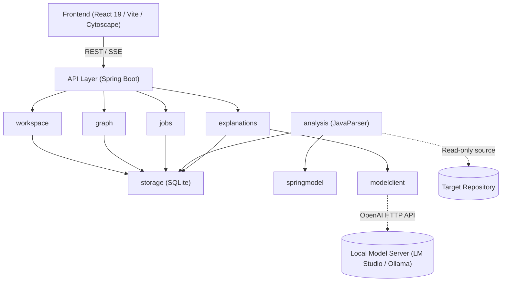

# Code Atlas — Architecture

## 1. System Overview

Code Atlas is structured as a local, lightweight modular monolith designed for privacy-preserving code comprehension:

- **Backend (Spring Boot 3.4.3 / Java 21)**: Runs on loopback (`http://127.0.0.1:8085`), coordinating AST parsing, static symbol resolution, graph querying, and local LLM orchestration.
- **Frontend (React 19 / TypeScript / Vite)**: Single-page application providing an interactive canvas powered by Cytoscape.js for dependency graphs, coupled with source inspection.
- **Storage (SQLite 3 via JDBC)**: Embedded zero-config database configured with Write-Ahead Logging (WAL) and strict foreign key constraints, managed via Flyway migrations.



---

## 2. Module Boundaries

The backend enforces strict modular separation across domain boundaries:

| Module | Responsibility |
|---|---|
| `workspace` | Project root registration, path traversal validation, file filtering (includes/excludes), trust boundaries. |
| `analysis` | JavaParser integration, symbol extraction, type solving, relationship extraction, exact evidence coordinate calculation. |
| `springmodel` | Heuristic recognition of Spring stereotypes (`@Service`, `@Repository`, `@RestController`), constructor injection, `@Qualifier`, `@Bean`, and HTTP routes. |
| `graph` | Graph querying, neighborhood traversal, package/class aggregation, search, cycle detection, and filtering. |
| `explanations` | Context construction, prompt generation, JSON response schema validation, claim basis attribution, and explanation caching. |
| `modelclient` | OpenAI-compatible HTTP client adapter, connectivity verification, latency tracking, timeouts, and error handling. |
| `jobs` | Background task orchestration, progress tracking, status reporting, cancellation, and restart recovery. |
| `storage` | SQLite connection management, Flyway migrations, database constraints, and repository data access. |
| `api` | REST endpoints, SSE stream handlers, DTO validation, and structured error responses. |

---

## 3. Trust Model: Parser Facts vs. AI Explanations

Code Atlas strictly decouples deterministic code facts from probabilistic language model explanations:

```
+-------------------------------------------------------------------------+
|                              CODE FACTS                                 |
| Source: JavaParser AST & Symbol Solver (Deterministic)                 |
| Authority: Defines graph topology, symbols, call sites, and evidence.   |
| Statuses: resolved | candidate | unresolved                            |
+-------------------------------------------------------------------------+
                                    |
                                    v
+-------------------------------------------------------------------------+
|                           AI EXPLANATIONS                               |
| Source: Local LLM (Probabilistic)                                      |
| Authority: Generates narrative summaries and inferred purposes.         |
| Constraint: Cannot create, modify, or delete graph nodes or edges.     |
| Claim Basis: source_fact | inferred_purpose | unknown                   |
+-------------------------------------------------------------------------+
```

1. **Deterministic Code Facts**: Parser facts own graph topology. Nodes (classes, methods) and edges (calls, injection, inheritance) are grounded directly in source text with byte/line/column ranges.
2. **Probabilistic Explanations**: Model output provides explanations only. Every explanation references specific evidence IDs, records prompt/model provenance, and separates verifiable source facts from inferred developer intent.
3. **Graceful Degradation**: If the local model is unconfigured or offline, graph visualization, symbol lookup, and source navigation remain fully functional.

---

## 4. Data Flow

```
[Import Source] ──> [Parse AST] ──> [Resolve Symbols] ──> [Publish Snapshot] ──> [Query Graph] ──> [Generate Explanation]
```

1. **Import**: User registers a local repository directory. The workspace boundary checks ensure paths are safe and canonicalized.
2. **Parse**: Source files are discovered and parsed into ASTs using JavaParser. Type declarations, methods, fields, and constructors are extracted.
3. **Resolve**: Relationships (call sites, type usages, inheritance, Spring bean injections) are resolved against the symbol table, assigning an explicit status (`resolved`, `candidate`, `unresolved`).
4. **Snapshot**: Extracted symbols, relationships, and evidence ranges are written to SQLite within an isolated staging snapshot. Upon complete validation, the snapshot is atomically marked published.
5. **Graph**: The frontend queries the graph service to obtain filtered, focused, or aggregated graph views rendered via Cytoscape.js.
6. **Explain**: When an element or relationship is inspected, relevant code evidence and graph context are assembled into a constrained prompt sent to the local model. Responses are validated against a strict JSON schema before display.

---

## 5. Frontend Feature Folders

The frontend is structured by functional domain under `frontend/src/features/`:

- **`import/`**: Repository registration, source path selection, scan progress, and diagnostics.
- **`explorer/`**: Interactive Cytoscape graph canvas, package/class navigation pane, search, minimap, and zoom controls.
- **`inspector/`**: Contextual sidebar displaying selected symbol/relationship details, parser evidence, and AI explanations.
- **`source/`**: Embedded source code viewer with line/column highlighting mapped to evidence coordinates.
- **`flows/`**: Static request flow explorer tracking paths from HTTP endpoints through services to repositories.
- **`settings/`**: Configuration interface for local model endpoints (LM Studio, Ollama), token budgets, and indexing rules.

---

## 6. Key Design Decisions

- **Source-Only Analysis**: Analyzes Java code statically without running Gradle tasks, build plugins, or compilers. The analyzed repository is strictly read-only and untrusted.
- **Modular Monolith**: Kept as a single deployable application to eliminate distributed network complexity and minimize resource footprint.
- **Snapshot Immutability**: Each indexing run produces a versioned snapshot. Graphs and explanations point to specific snapshots, preventing stale concurrency errors.
- **Connection-Level SQLite Foreign Keys**: Strict relational constraints prevent orphaned evidence or cross-snapshot contamination. WAL mode enables concurrent reads during background jobs.
- **Structured JSON Schema for AI**: Model output is constrained to a strict JSON contract (`explanation-schema.json`) with claims classified by basis and linked to evidence IDs.
