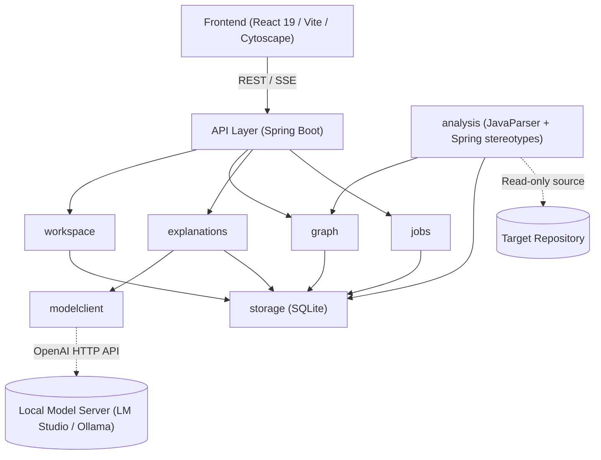
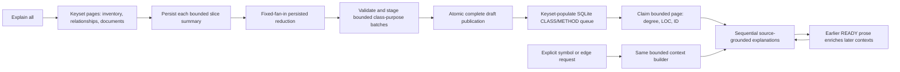

# Code Atlas — Architecture

## 1. System Overview

Code Atlas is structured as a local, lightweight modular monolith designed for privacy-preserving code comprehension:

- **Backend (Spring Boot 3.4.3 / Java 21)**: Runs on loopback (`http://127.0.0.1:8085`), coordinating AST parsing, static symbol resolution, graph querying, and local LLM orchestration.
- **Frontend (React 19 / TypeScript / Vite)**: Single-page application providing an interactive canvas powered by Cytoscape.js for dependency graphs, coupled with source inspection.
- **Storage (SQLite 3 via JDBC)**: Embedded zero-config database configured with Write-Ahead Logging (WAL) and strict foreign key constraints, managed via Flyway migrations.



---

## 2. Module Boundaries

The backend enforces strict modular separation across domain boundaries:

| Module | Responsibility |
|---|---|
| `workspace` | Project root registration, path traversal validation, file filtering (includes/excludes), trust boundaries. |
| `analysis` | Per-language adapters behind a shared analysis port (Java today, with two engines: JavaParser and scip-java, ADR 0012): source discovery hooks, symbol extraction, type solving, relationship extraction and exact evidence coordinates. Go and Dart adapters are deferred. |
| `analysis` (Spring heuristics) | Heuristic recognition of Spring stereotypes (`@Service`, `@Repository`, `@RestController`), constructor injection, `@Qualifier`, `@Bean`, and HTTP routes. Implemented by `analysis/SpringAnnotationAnalyzer.java`; this is not a separate top-level package. |
| `graph` | Graph querying, neighborhood traversal, package/class aggregation, search, cycle detection, and filtering. |
| `explanations` | Context construction, prompt generation, JSON response schema validation, claim basis attribution, and explanation caching. |
| `modelclient` | OpenAI-compatible HTTP client adapter, connectivity verification, latency tracking, timeouts, and error handling. |
| `jobs` | Background task orchestration, progress tracking, status reporting, cancellation, and restart recovery. |
| `storage` | SQLite connection management, Flyway migrations, database constraints, and repository data access. |
| `api` | REST endpoints, SSE stream handlers, DTO validation, and structured error responses. |
| `review` | Read-only local Git capture, isolated before/after analysis and deterministic snapshot comparison. |
| `design` | The engineer-owned design layer (ADR 0014): authored resources/relations and explanations keyed by stable keys, status computed against a snapshot, atomic agent change sets, the Markdown design brief (export/import). |

---

### Language analysis boundary

`analysis.port.AnalysisPort` supplies discovery, preparation, declaration and relationship
passes, optional cross-file relationship linking and framework enrichment, diagnostics,
and cache cleanup. Review preparation accepts the captured source root and the original
workspace root so Java symbol resolution retains the workspace layout. Cross-file
linking runs in one transaction; the Java adapter supplies the existing OVERRIDES pass. `AnalysisPortRegistry` selects a shipped adapter
by the workspace's normalized language identifier. `JavaAnalysisAdapter` delegates to the
unchanged JavaParser implementation and existing evidence/storage schema. Both ordinary
analysis and retained-source Git review use the same synchronized analysis service;
per-file transactions and cleanup on failure remain in place. `SpringAnnotationAnalyzer`
stays Java-specific inside `JavaAnalysisAdapter`; the shared orchestration invokes its
optional framework hook without branching on a language name. Roles/routes/beans are
persisted before injection resolution, and skipped Spring files remain visible in diagnostics.

The port preserves the existing persistence-backed two-pass contract: adapters write
declarations first, then relationships and their evidence through the current graph
schema. It does not introduce another in-memory fact representation. Each relationship
must retain its resolution status and evidence coordinates; model explanations never
participate in extraction. In the current implementation those operations live in
`JavaParserAdapter`; the older `SymbolExtractor`, `RelationshipExtractor` and
`EvidenceCollector` classes are empty placeholders, not additional extraction engines.

V012 adds required `language` fields to workspaces and snapshots, backfilling `java`.
Workspace creation accepts a language and returns it; omitted/blank values retain the
Java default, and unsupported values are rejected before registration. Review snapshots
copy the workspace language. The import form offers only Java; Go and Dart adapters
have not shipped. See [ADR 0008](adr/0008-multi-language-support.md).

A language may ship several indexing engines ([ADR 0012](adr/0012-scip-java-indexer.md)).
The registry keys ports by language and engine id; `require(language)` still returns the
default engine. Java ships `javaparser` (default, source-only) and `scip-java`
(`ScipJavaAnalysisAdapter`), which runs the project's Gradle build through scip-java in a
private copy of the build root, with the owner's recorded consent
(`trust_state = 'build_allowed'`), and maps the resulting SCIP index onto the same symbol,
relationship and evidence shapes. V013 records `indexer` on workspaces and snapshots and adds
`code_occurrences`, the navigation-only occurrence index behind
`GET /api/snapshots/{id}/files/definition` and `/files/occurrences`. Review captures always use the default engine.
Source navigation is an engine capability, not a language one ([ADR 0013](adr/0013-source-code-navigation.md)):
an engine declares `AnalysisPort.providesNavigation()` and fills `code_occurrences` (1-based lines, inclusive
end columns in UTF-16 code units, opaque symbol keys). `graph.NavigationService` resolves a snapshot's recorded
engine to decide `not_indexed` and names the engines that do navigate. Its API has no language-specific code.
The workspace path may be a module: the Gradle build root is found by walking up to the nearest
settings file, never past the Git root, and only files under the workspace become graph facts.

Before a second language ships, the following end-to-end contracts need explicit
implementation decisions and real fixtures:

- `GitReviewSourceAdapter.javaPath()` captures only `.java` files in both base and
  working-tree materialization. Registering another analysis adapter does not change
  that capture policy. Review needs a trusted language-specific source and manifest
  input policy, or an explicit unsupported-capability gate, before non-Java review.
- The graph vocabulary and package-only explorer currently reveal packages → types
  → methods/constructors (`graphModel.childrenOf`). A package-level function represented
  as `METHOD` is not revealed as a package child. Top-level functions, structs/interfaces,
  mixins, call navigation, source viewing and Explain all eligibility need an honest
  graph/UI contract; adapters must not invent parser-owned classes to fit the display.
- The shared extension-based discovery helper excludes `.git`, `build` and `target`;
  adapters can supply their own discovery. Go build constraints and Dart package/SDK
  rules, missing-SDK errors, read-only native toolchain invocation and network isolation
  remain unimplemented and unverified. Fake-adapter dispatch tests prove selection and
  orchestration only, not real non-Java resolution, capture or UI behavior.

---

## 3. Trust Model: Parser Facts vs. AI Explanations

Code Atlas strictly decouples deterministic code facts from probabilistic language model explanations:

```
+-------------------------------------------------------------------------+
|                              CODE FACTS                                 |
| Source: JavaParser AST & Symbol Solver (Deterministic)                 |
| Authority: Defines graph topology, symbols, call sites, and evidence.   |
| Statuses: resolved | candidate | unresolved                            |
+-------------------------------------------------------------------------+
                                    |
                                    v
+-------------------------------------------------------------------------+
|                           AI EXPLANATIONS                               |
| Source: Local LLM (Probabilistic)                                      |
| Authority: Generates narrative summaries and inferred purposes.         |
| Constraint: Cannot create, modify, or delete graph nodes or edges.     |
| Claim Basis: source_fact | inferred_purpose | unknown                   |
+-------------------------------------------------------------------------+
```

1. **Deterministic Code Facts**: Parser facts own graph topology. Nodes (classes, methods) and edges (calls, injection, inheritance) are grounded directly in source text with byte/line/column ranges.
2. **Probabilistic Explanations**: Model output provides explanations only. Every explanation references specific evidence IDs, records prompt/model provenance, and separates verifiable source facts from inferred developer intent.
3. **Graceful Degradation**: If the local model is unconfigured or offline, graph visualization, symbol lookup, and source navigation remain fully functional.
4. **Design layer** ([ADR 0014](adr/0014-design-layer.md)): a third, engineer-owned layer. Resources and
   relations the engineer or an AI agent adds, and explanations on any element (first paragraph = intent),
   live in `design_resources`/`design_relations`, keyed by the parser's stable keys. They are drawn dashed
   violet (relations with resolution `DESIGNED`), never mixed into parser facts, never written by analysis
   or models. The model may read an engineer explanation as an untrusted `design-` context block.

---

## 4. Data Flow

```
[Import Source] ──> [Parse AST] ──> [Resolve Symbols] ──> [Publish Snapshot] ──> [Query Graph] ──> [Generate Explanation]
```

1. **Import**: User registers a local repository directory. The workspace boundary checks ensure paths are safe and canonicalized.
2. **Parse**: Source files are discovered and parsed into ASTs using JavaParser. Type declarations, methods, fields, and constructors are extracted.
3. **Resolve**: Relationships (call sites, type usages, inheritance, Spring bean injections) are resolved against the symbol table, assigning an explicit status (`resolved`, `candidate`, `unresolved`).
4. **Snapshot**: Extracted symbols, relationships, and evidence ranges are written to SQLite within an isolated staging snapshot. Upon complete validation, the snapshot is atomically marked published.
5. **Graph**: The frontend queries the graph service to obtain filtered, focused, or aggregated graph views rendered via Cytoscape.js.
6. **Explain**: When an element or relationship is inspected, relevant code evidence and graph context are assembled into a constrained prompt sent to the local model. Responses are validated against a strict JSON schema before display.

---

## 5. Frontend Feature Folders

The frontend is structured by functional domain under `frontend/src/features/`:

- **`import/`**: Repository registration, source path selection, scan progress, and diagnostics.
- **`explorer/`**: Interactive Cytoscape graph canvas, package/class navigation pane, search, minimap, and zoom controls.
- **`inspector/`**: Contextual sidebar displaying selected symbol/relationship details, parser evidence, and AI explanations.
- **`source/`**: Embedded source code viewer with line/column highlighting mapped to evidence coordinates.
  Find in file (`findInFile.ts`, literal text, Unicode whole word) works for every snapshot. Ctrl/Cmd+click go to
  definition tokenizes lines only from occurrence rows (`codeTokens.ts`). Its dialog-local back/forward stack
  (`navigationStack.ts`) is outside undo history, like selection. See ADR 0013.
- **`settings/`**: Configuration interface for local model endpoints (LM Studio, Ollama), token budgets, and indexing rules.

### Explorer scope boundary

Backend PACKAGE symbols remain flat parser facts. The explorer constructs a display-only
trie from their dotted qualified names so missing namespace prefixes can be shown without
creating canonical symbols or edges. Synthetic namespace checkboxes aggregate and batch-edit
their real descendant package IDs through the same immutable `ScopeSelection` helpers used
by leaf package/class controls. Shared single-child namespace paths start expanded, branch
points start collapsed, and selection/search expands the owning package path.

Within an active snapshot, navigation and inspection do not mutate scope. Scope changes only
through explicitly labelled tree/reset controls or Cytoscape's “Remove from scope” command.
That command resolves methods/constructors to their owning class and delegates to the existing
package/class toggles. Loading another snapshot initializes a new whole-system selection because
the prior snapshot's symbol IDs are no longer a valid boundary.

### Exploration tabs and undo history

`explorerJourney.ts` owns independent, in-memory exploration tabs around the existing
`explorerViewState` reducer. Each tab's history retains its scope, per-level geometry and
expanded cards, relationship filter, tree disclosures, search, source-dialog subject and pane
controls. Fullscreen, Map overview and
button zoom remain per-tab/current-view values but are rebased across history rather than
creating or being restored by undo/redo. Selection (inspected subject, occurrence, Back
trail, multi-selection) is outside history too (ADR 0009). An `UPDATE` that changes only
selection, optionally with the tree reveal, search reset and pane that accompany a click,
replaces `present` without a history entry. `UNDO`/`REDO` carry the current selection into
the restored entry and prune it with `revalidateJourney.pruneRestoredSelection`, which
compares the cards and routes drawn before and after the step and drops inspected,
multi-selected and Back-trail subjects that left the map. App passes a `graphFor`
lookup so that comparison uses each journey's real graph. New tabs start from the
snapshot's initial view; clones share immutable values and inherit both undo and redo
branches. Closing a tab retains its history among the ten most recently closed tabs.

`useExplorerJourneys` groups synchronous updates from a user action into one history
entry (up to 200 per tab). An action that needs several renders (a sequential expand
queue: the card menu's Expand/Collapse on a selection, Entry points → Explore, View
classes/methods into collapsed cards) takes an explicit group from `beginGroup()` and passes
it to each update, so it is still one entry; any other update in between starts its own. Initial camera fitting updates the baseline without creating
an undo step. Pending camera changes flush before navigation commands. Tab IDs are never
reused across snapshot resets, so an old callback cannot edit a replacement snapshot.
`<main>` is keyed on the active tab's ID, so switching tabs remounts it and restores that
tab's saved widget state. Undo/redo does not remount it (that would drop keyboard focus
from the navigation pane or inspector): only `GraphCanvas` consumes a `restoreVersion`
counter, via its own effect, to resync Cytoscape's live positions/camera to the restored
tab state. Ordinary inspection and filtering preserve the mounted canvas untouched.

The outgoing relation stack and its incoming mirror (`docs/OUTGOING_STACK.md`) follow the same
layering. The pure helper
`outgoingStack.ts` walks the tab graph's relationship facts at the root's granularity and maps the
result onto the cards and routes the canvas draws. The walk is a 0-1 BFS with card-hop costs. Method
roots also reach type targets as dead ends and follow parser OVERRIDES facts reversed (dispatch). It
counts reached entities with no card as "beyond the map". The analyzer supplies the OVERRIDES facts
this relies on (ADR 0010; candidate calls were withdrawn, ADR 0010 amendment, 2026-09-25).
The journey keeps its pinned
root and direction (`relationStack`, one value) outside history like selection (carried and pruned on undo/redo) and also prunes it in the
reducer when an ordinary update or recapture stops drawing it. App computes the stack from the
projection in the root's direction (the incoming stack reverses every step), and `GraphCanvas` only
applies classes and draws layer badges on its direction overlay, cyan or indigo by direction.
It never moves cards or the camera.

Ungroup (ADR 0011) is an expansion whose box is hidden (`ExpansionState.hidden` →
`projectDisplayed`'s `hiddenBox`), not a change of level or membership. The pure layout helpers
look through a hidden box to its children: `expansionLayout.roomMoves` for make-room (App's
expand/collapse/resize), `focusedArrangement.arrangeDisplayed` for double-click arrangement, and
`outgoingStack`, which hands a hidden box's layer to its freed cards. `revalidateJourney` counts a
hidden card as off the map. `GraphCanvas` only styles it invisible and inert.

Renderer inputs must not alias saved state: Cytoscape retains and mutates coordinates
passed to `add()`, so `GraphCanvas` copies positions at that boundary. Parser graph data,
explanation responses, project documents, settings and backend jobs stay outside history.
Undo restores exploration state; it does not reverse server operations. Zooming with the
dedicated +/− buttons, toggling fullscreen and toggling Map overview do not consume an undo
step and stay unchanged while another action is undone or redone. Tabs/history are
discarded on reload or loading a new analysis snapshot. DOM scroll offsets, text selection,
transient menus and disclosures inside generated explanations are not stored.

---

## 6. Key Design Decisions

### Git review comparison

[ADR 0006](adr/0006-git-review-snapshots.md) defines the revision boundary.
The review adapter captures a resolved local base commit and working-tree content
outside the target repository. The analysis service parses those private copies
into independent retained-source snapshots without publishing either as the normal
workspace snapshot. A deterministic comparison supplies versioned resource and
relationship changes; the model is not involved.

The frontend projects only the Base+changes overlay from the comparison and draws
it directly on the ordinary Code map -- there is no separate review page, report
or legend. A **Changes** toggle in the graph toolbar swaps the active tab's graph
between the workspace's ordinary snapshot and the overlay; whether a tab shows
changes is per-tab state carried in its exploration journey (`explorerJourney.ts`),
so `+ New tab` opens beside the current tab in the same mode and `Clone tab`
copies it along with layout and undo/redo history, and toggling itself is one
undoable step. Display identities do not replace actual snapshot subject IDs:
source evidence requests retain their side. Overlay relationship aggregation also
retains change status, allowing added and removed occurrences between the same
displayed resources to remain independently inspectable. Unchanged exploration
uses the existing graph projection and rendering conventions.

The Changes toggle retains one current exploration state per tab. Unambiguous
comparison declarations reuse their ordinary map display identities, so the
renderer preserves surviving cards and their geometry. Review source identities
remain pinned to the captured base/head snapshots. Mode changes do not restore
separate parked layouts; review-only resources remain distinguishable from the
ordinary analysis snapshot. See the layout-continuity addendum in ADR 0006.

Opening a changed file's code (or its relationship evidence) renders a git-style
diff (`features/source/fileDiff.ts` builds unified/split rows from the
comparison's retained `git diff --unified=0` hunks and both snapshots' whole-file
content, fetched via `GET /api/snapshots/{id}/files/source`) instead of plain
highlighted source.

- **Source-Only Analysis**: Analyzes Java code statically without running Gradle tasks, build plugins, or compilers. The analyzed repository is strictly read-only and untrusted.
- **Modular Monolith**: Kept as a single deployable application to eliminate distributed network complexity and minimize resource footprint.
- **Snapshot Immutability**: Each indexing run produces a versioned snapshot. Graphs and explanations point to specific snapshots, preventing stale concurrency errors.
- **Connection-Level SQLite Foreign Keys**: Strict relational constraints prevent orphaned evidence or cross-snapshot contamination. WAL mode enables concurrent reads during background jobs.
- **Structured JSON Schema for AI**: Model output is constrained to a strict JSON contract (`explanation-schema.json`) with claims classified by basis and linked to evidence IDs.

## 7. Hierarchical explanations (R6)

The current explanation flow is defined in [ADR 0003](adr/0003-hierarchical-explanations.md),
[ADR 0004](adr/0004-bounded-architecture-batches.md), and its bounded-working-set
refinement [ADR 0005](adr/0005-bounded-explanation-working-sets.md):



The loop represents reading already stored prose, not recursive generation. Relations
are strictly on-demand. Job synthesis failure blocks its bulk members while leaving
graph browsing and independent on-demand requests available. Drafts have distinct
storage/API presentation and never produce READY badges. Refreshing consumed prose
can stale dependent results; newly available unrelated prose does not.

The active React `InspectorPanel` implements all inspector types. Graph statuses
refresh through the graph API; Cytoscape updates card/edge display data without
recreating the canvas or resetting its viewport. Shared sparkle styling is purely
a READY marker. Routes are not styled by resolution (ADR 0008 amendment, 2026-09-25).

Architecture preparation never constructs a complete inventory String or purpose
Map. It retains one page/fan-in/class batch, persists validated work immediately,
and reconstructs downstream inputs from ordered SQLite pages. Coupling ancestry is
resolved for only the current relationship page. Final class coverage is published
atomically; partial staging cannot become READY. Queue population and claims are
also bounded SQL pages, with `-1` as the resumable not-yet-populated job marker.

The same `ContextBuilder` limits source, collaborators, methods, evidence occurrences,
documents, prior prose and global inventories for bulk, explicit symbol/method, and
edge explanations. Its `context-limits` evidence block makes omitted/truncated input
visible. The model adapter independently caps serialized request and streamed response
bytes and permits one outstanding request. Queue status is aggregate-only. React
polling is serialized and lifecycle-scoped, so slow requests do not overlap or update
an inactive workspace.

## 8. Design layer, agent API and design brief (ADR 0014)

```
[Engineer UI] ─┐                                  ┌─> GET  /design            overlay + computed status
               ├─> POST /design/changes (atomic) ─┤
[AI agent] ────┘    author recorded, no review    └─> POST /design/export     Markdown brief + json block
                                                      POST /design/import     upsert by key, never deletes
                                                      GET  /design/prompt     plain request, outstanding work (ADR 0016)
[First page] ── POST /api/workspaces/design-only ─> empty published snapshot, then /design/import (ADR 0016)
```

- `design.DesignService` validates keys/kinds (`DesignKeys` mirrors `JavaParserAdapter` keys), applies
  change sets in one transaction (`dryRun` rolls back), and resolves the overlay against a snapshot:
  `PLANNED`/`IMPLEMENTED` (authored), `PRESENT`/`MISSING` (code references), `ORPHANED`. A designed
  relation is `IMPLEMENTED` when a parser relationship of its kind joins its endpoints or anything inside them.
- `design.DesignExchangeService` renders the brief (reading contract, module tree with explanations,
  relations, `AgentGuide`, fenced `json codeatlas-design` block with layout) and imports it, creating
  `MISSING` placeholders for parsed resources the target code lacks.
- Frontend: `features/design/designModel.ts` (pure) merges the overlay into the ordinary map graph
  (`design:<key>` cards, `design-rel:<id>` routes, annotations on parsed cards); `aggregateEdges` keys a
  designed relation on its own route. `designExchange.ts` (pure) captures/applies a tab layout by key.
  App reconciles every tab's current journey in place when the merged graph changes (`RECONCILE_ALL`):
  design edits are server operations outside undo history. The Changes overlay never shows the design layer.
- Design mode (ADR 0015), by layer:
  - pure: `designModel.ts` (`parseInlineName`, `defaultRelationKind`, change-set builders, `unionGraphs`) and
    `expansionLayout.designBlocks` / `boxWithBlocks` / `addBlockAt` (ADR 0017: a block anywhere empty under
    the pointer, in the exact shape the card takes; an empty box is one card-sized block at its corner). Round 4:
    a box with no space left grows a band one card tall below its children (`designBlocks.band`, part of
    `AddArea.inner`), and `addBlockNear` gives the block a hover anywhere in the box shows (under the pointer, or
    the nearest one from `AddArea.regions`); `draftCamera` is the camera a too-small draft brings. All of this goes through `placementGeometry` (`{designSlots}` → `slots` as a
    list per box, `areas`, `slotMinSizes`). Round 3: `freeRect` is exact (every maximal empty rectangle
    around the pointer, scored); `addBlockAt` snaps to `ADD_BLOCK_SNAP`; `addBlockNear`, `blockStillOpen`,
    `draftCamera` and `emptyBoxCenter`/`emptyBoxAnchor` are the canvas's only geometry. `graphModel.childlessExpansionsAsCards`
    draws an expansion with nothing inside as its card (`drawnAsCard`) outside design mode, or when ungrouped.
    `designModel.takeAdmitted` releases a pending pin or growth only to the reconciliation that admits its card;
  - reducer: `explorerViewState` pins a card typed in place (`PlacementDims.pinned`) and carries parked children
    with a moved box (`carryUnreportedChildren`);
  - App: the inline draft, the popover, the two-click relation, and, inside `RECONCILE_ALL` (whose reconcile
    receives each tab's id), storing a new card in its block's shape: the typed tab (`Growth.tabId`) pins it at
    the block and makes room when it grows its box (measured against the boxes before the change, so nested
    growth cascades), other tabs give it the same size. The collapse of a `drawnAsCard` expansion is measured
    in design-mode geometry (`collapseRoomAsInDesign`), so a Design-off collapse gives back exactly the room the
    expansion took. While Design is off, App parks the design-merged graph, so design geometry survives
    the toggle;
  - adapter: `GraphCanvas` only draws the hovered box's add block (`.hot` under the pointer, `.near` otherwise;
    only `.hot` is clicked), moves the camera to a too-small draft, and draws an empty expanded box (a plain node sized by its
    block), the handle, the rubber band (direction-overlay canvas, never a
    Cytoscape element) and the draft card.
- `design.DesignPromptService` (`GET /design/prompt`) renders the outstanding designed work as a plain request
  any coding agent can follow without knowing the tool (ADR 0016): **Add** (planned resources), **Change**
  (intentions on existing code and on relations the code has), **Connect** (designed relations not yet in the
  code). Implemented and orphaned items are left out.
- ADR 0016:
  - `design_relations.origin` (V015) separates designed relations (AUTHORED) from parsed dependencies carried
    along (CODE: an explained relation the code has, or one imported from another map). CODE relations are
    ordinary grey routes (`aggregateEdges` merges them with the parser route); imported resources the code lacks
    are ordinary cards tagged "imported" (`isImported`).
  - After any create, `DesignQuickPopup` asks for the intent then the kind (relations: at the route's middle);
    double-click keeps the full `DesignPopover`.
  - A design-only project (`trust_state = design_only`, `canonical_root = design-only:<id>`, one empty published
    snapshot) holds a map imported from the first page; its layout becomes the first tab (`RESET` with a scope).
    It is never analyzed and has no Changes.
